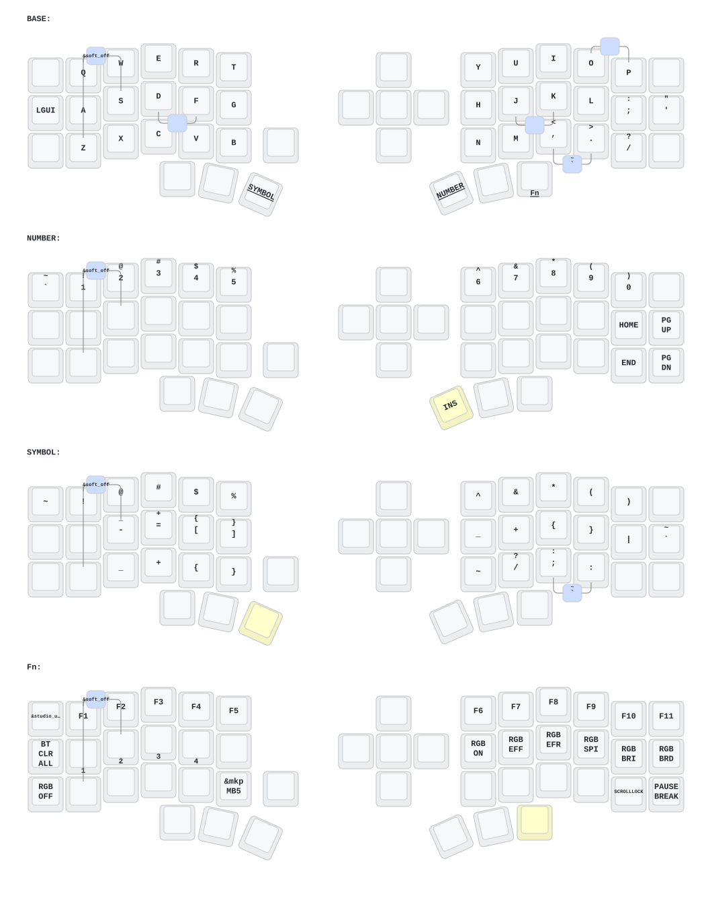

# Eyelash Peripherals Corne ZMK Repository

**This keyboard is not the same as [foostan's Corne](https://github.com/foostan/crkbd). It will not work with standard `corne` firmware.**

If you need a 3D model of this keyboard, email `380465425@qq.com`.

## Vendor autonomy (this branch)

This branch vendors all third-party keyboard firmware dependencies under `vendor/`. Builds no longer fetch code from vendor GitHub accounts at compile time.

See [VENDOR.md](VENDOR.md) for archived sources, pinned commits, and local build instructions.

## Instructions

1. [Fork this repository](https://docs.github.com/en/get-started/quickstart/fork-a-repo#forking-a-repository).
2. [Click the **Actions** tab and make sure the workflow is enabled](https://docs.github.com/en/actions/managing-workflow-runs-and-deployments/managing-workflow-runs/disabling-and-enabling-a-workflow#enabling-a-workflow).
3. Board shield definitions are included in this repo under `boards/shields/eyelash_corne/`. No external board download is required on this branch.
4. If your fork still has a legacy `boards/arm/eyelash_corne` folder, delete it.

**If you already have a ZMK config repository, [you can add this one as a module instead of forking](https://zmk.dev/docs/features/modules#building-with-modules).**

## Keymap Diagram

